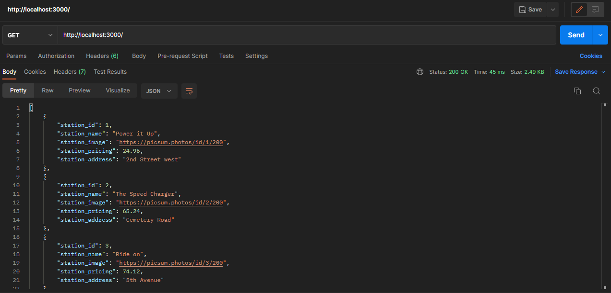
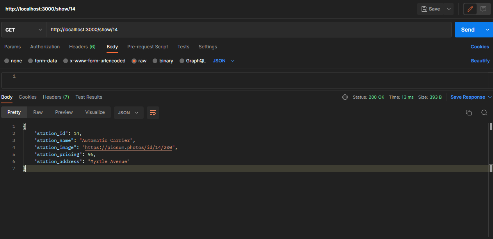
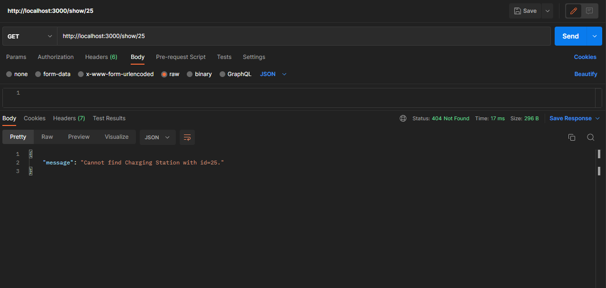
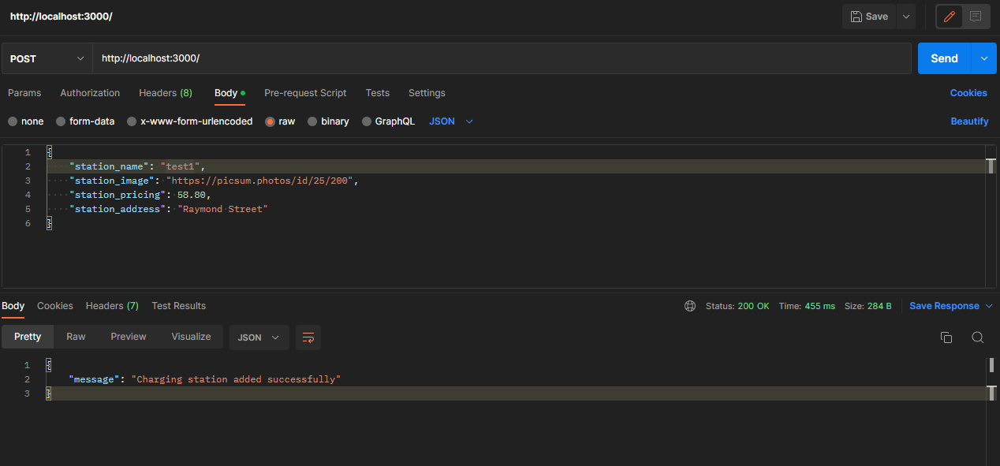
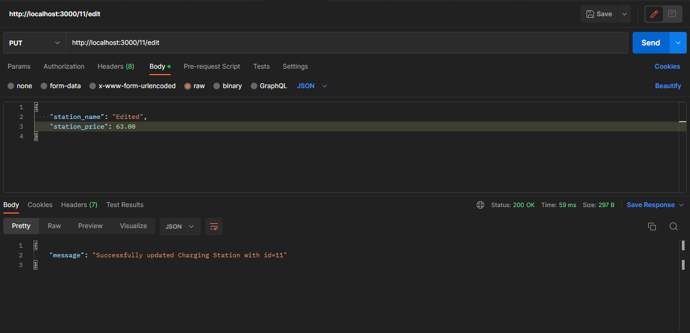
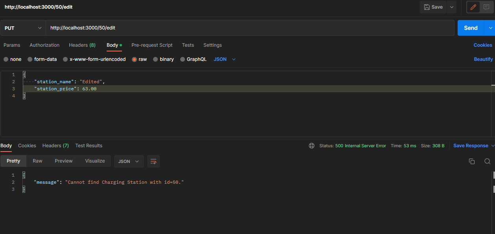
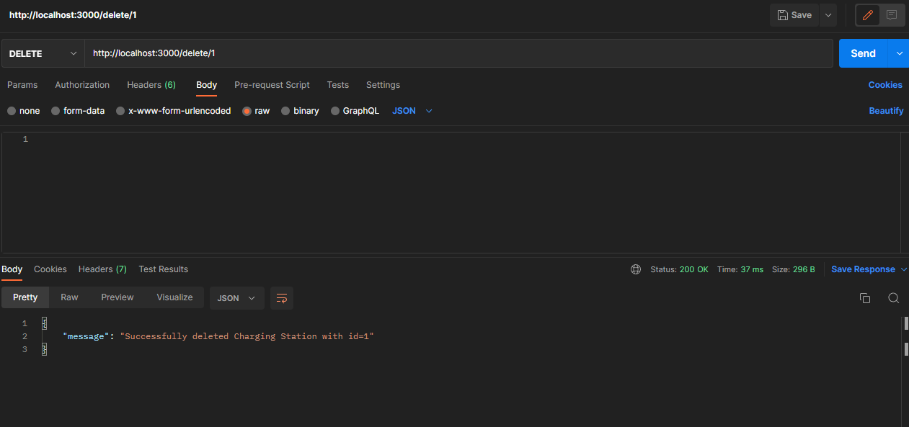
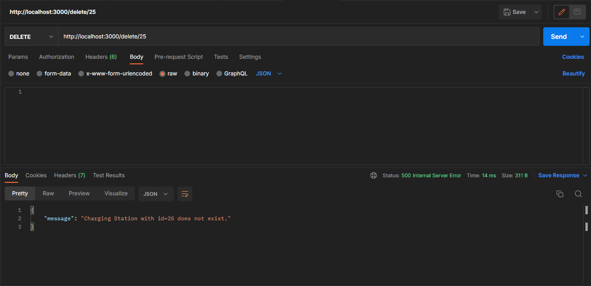
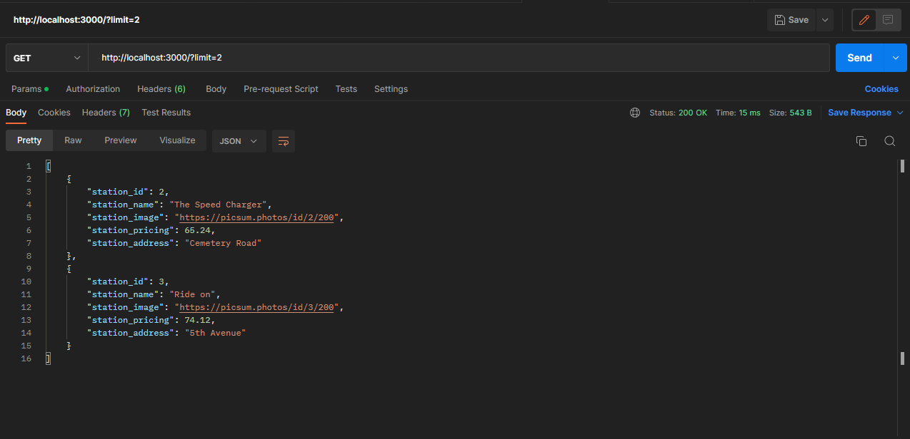
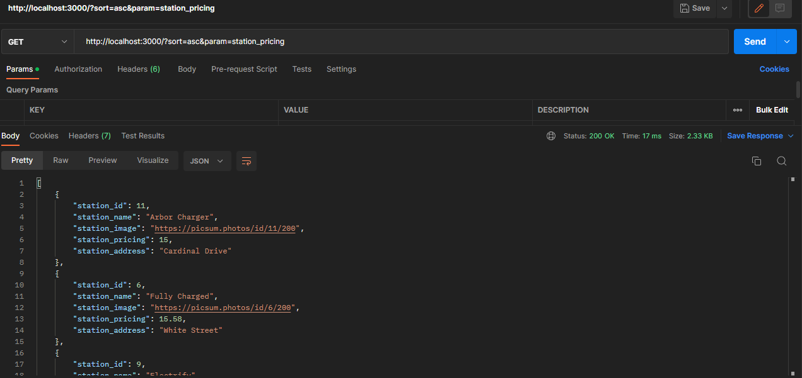

# EV Charging Station - Backend Application

## Requirements

For development, you will only need Node.js and a node global package, NPM, installed in your environement.

## Install

- Extract the files in a directory
- `$ cd ev-charging-station`
- `$ npm install`

## Running the project

### Running in Development Environment

- This will add the default data to database

`$ npm start`

### Running in Production Environment

`$ npm run start:prod`

## Tech Stack

- Node.js
- Express.js
- Sequelize
- Sqlite3 database

## Endpoints with Examples

BASE URL : http://localhost:3000

## 1. GET Request to Base URL

- Returns all the entries in the database



## 2. GET Request to /show/:id

- Returns the entry having requested id if the entry exists, otherwise returns a response saying cannot find requested id





## 3. POST Request to /

- Creates and adds new entry to the database with the given details



## 4. PUT Request to /:id/edit

- Updates the entry if the id exists, otherwise returns a response saying cannot find requested id





## 5. DELETE Request to /delete/:id

- Deletes the entry if the id exists, otherwise returns a response saying id does not exist





## 6. GET Request to /?limit=10

- Show atmost 10 entires
- limit value can be any integer



## 7. GET Request to /?sort=asc&&param=station_pricing

param values

- station_name
- station_pricing
- station_address
- station_id

sort values

- asc
- desc



## Structure of the project

```
ev-charging-station
|------- app
|         |----- controllers
|         |         |------ station.controller.js
|         |----- models
|         |         |---- index.js
|         |         |---- station.model.js
|         |----- routes
|         |         |---- station.routes.js
|------- node_modules
|------- database.db
|------- package-lock.json
|------- package.json
|------- README.md
|------- server.js
```

---
